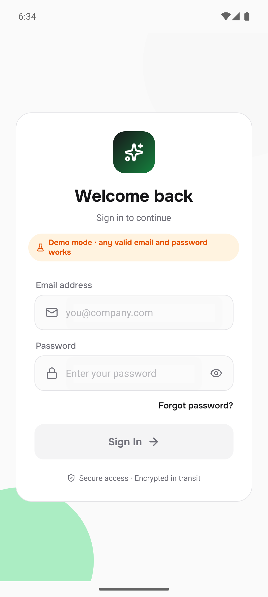
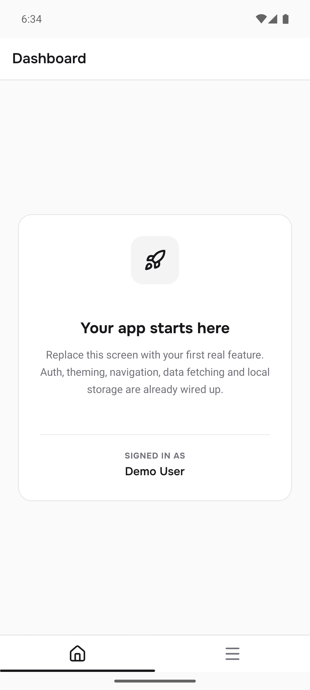
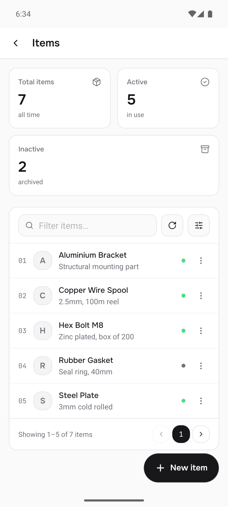
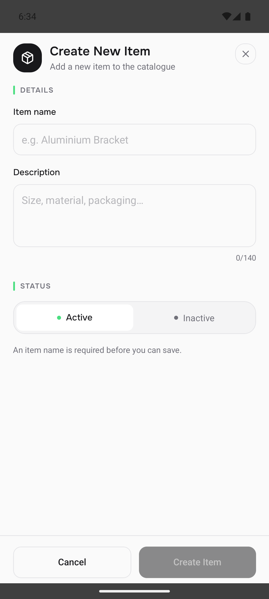
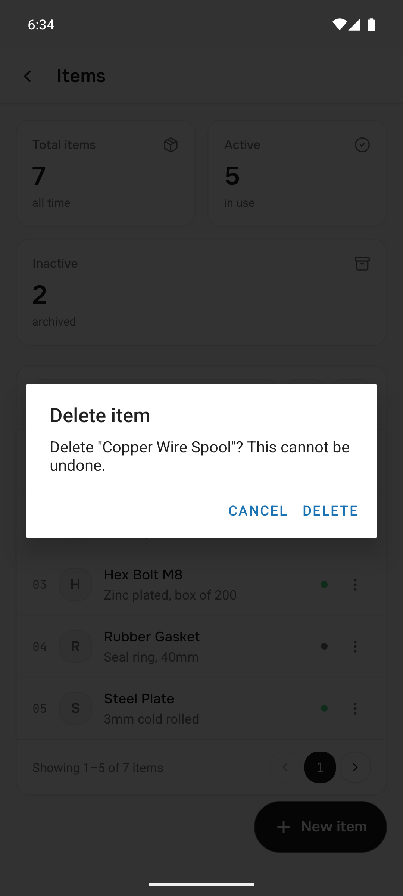
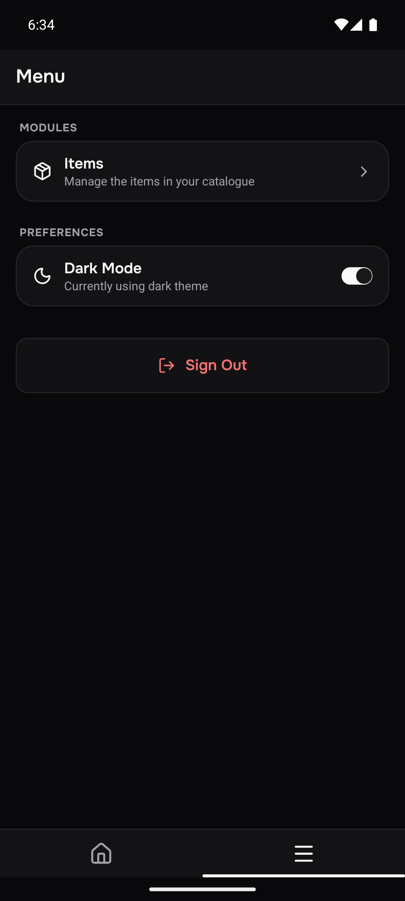

# Expo Template 2026

An Expo / React Native starter with the boring parts already wired up: auth,
theming, navigation, data fetching and offline SQLite — plus a complete
**module pattern** for the list-and-form screens most admin apps are made of.

Everything here is plumbing you would otherwise rebuild on every project. There
is no domain to delete: the one example module is a generic *Items* catalogue
you rename or remove.

**Stack:** Expo SDK 57 · React Native 0.86 · React 19.2 · React Navigation 7 ·
[React Native Reusables](https://reactnativereusables.com) + NativeWind
(Tailwind) · TanStack Query 5 · Zustand 5 · Axios · expo-sqlite · lucide icons ·
Onest + JetBrains Mono

---

## What it looks like

| Login | Dashboard | Items module |
| :---: | :---: | :---: |
|  |  |  |
| Email validation, password reveal, and the amber badge shown only in demo mode | The placeholder tab you replace with your first feature | Stat row, filter bar, card list, pager and a flat FAB |

| Create / edit sheet | Confirm dialog | Light + dark |
| :---: | :---: | :---: |
|  |  |  |
| Full-screen sheet, accent section labels, segmented status, dirty-check save | Destructive actions confirm first | Every screen is built from tokens, so both themes come free — [light](assets/screenshot/03-menu-light.png) |

The palette is monochrome surfaces with a single green accent. Primary actions
are **inverted** — near-black in light, near-white in dark — and green is
reserved for status dots, section ticks and focus rings, never buttons.

---

## Quick start

```bash
npm install
cp .env.example .env          # then set EXPO_PUBLIC_API_URL
npx expo start
```

**No backend yet?** Set `EXPO_PUBLIC_DEMO_MODE=true` in `.env` and any valid
email and password will sign you in — see [Demo mode](#demo-mode).

Press `a` for Android, `i` for iOS, or scan the QR code with Expo Go.

Some dependencies need native code, so **Expo Go will not run everything**.
For a full build:

```bash
npx expo prebuild          # generates android/ and ios/ (both gitignored)
npx expo run:android       # or run:ios
```

---

## What's included

| Area | What you get |
| --- | --- |
| **Auth** | Login screen with email validation, JWT persisted to AsyncStorage, axios request interceptor that attaches the token, auto-logout on `Invalid token` |
| **Navigation** | Auth-gated stack — the whole navigator swaps on `isAuthenticated`, so logging out cannot be navigated back into |
| **Theming** | Token-driven light + dark, persisted toggle, driven by the app rather than the OS |
| **Typography** | Onest (UI) + JetBrains Mono (numerals, ids), loaded behind the splash screen |
| **Data fetching** | TanStack Query provider, plus an `api/` → `requests/` split (see below) |
| **Local storage** | SQLite wrapper with transactions and prepared statements, a numbered-migration runner, and one worked example table |
| **Module pattern** | Header, stat cards, searchable card list, pagination, FAB, create/edit sheet — with a working module to copy |
| **UI kit** | RNR primitives, toasts, a dialog provider, loading indicators, a date-range picker |
| **Demo mode** | One env flag runs the whole app with no backend at all |

**Docs:** [design guidelines](docs/DESIGN_GUIDELINES.md) ·
[module pattern](docs/MODULE_PATTERN.md) ·
[engineering checklist](docs/ENGINEERING_CHECKLIST.md)

---

## Make it yours

Before your first commit:

1. **App identity** — [app.json](app.json): `name`, `slug`, `android.package`,
   `ios.bundleIdentifier`. Bundle IDs are permanent once published, pick
   carefully.
2. **Package** — [package.json](package.json): `name`, `description`.
3. **Icons** — [assets/](assets/) ships placeholder art. Replace `icon.png`,
   `adaptive-icon.png`, `splash-icon.png` and `favicon.png`, and set
   `android.adaptiveIcon.backgroundColor` to match.
4. **Theme** — edit the token values in [global.css](global.css), then mirror
   any change into [src/lib/theme.js](src/lib/theme.js) (see
   [Theming](#theming)). Generate a palette at
   [ui.shadcn.com/themes](https://ui.shadcn.com/themes) or
   [tweakcn](https://tweakcn.com).
5. **API** — set `EXPO_PUBLIC_API_URL` in `.env`. The auth routes assume
   `POST /api/v1/admin/auth/login|logout|change-password` and `GET .../me`;
   change `BASE` in [src/services/api/auth.js](src/services/api/auth.js) to
   match your backend.
6. **EAS** — run `eas init` to create your own project ID. The template
   deliberately ships no `projectId` or `owner`.
7. **Delete the examples** — `Screens/Example/`, the `Items` row in
   [Settings](src/Screens/Home/Settings/index.js), `constants/demo.js`, and the
   `example.table.js` / `example.endpoints.js` pair once you have real ones.

---

## Project structure

```
src/
├─ Navigation/        Stack navigator, auth-gated
├─ Screens/
│  ├─ Login/          Reference implementation for the design guidelines
│  ├─ Example/        Reference module — copy this to start a new one
│  └─ Home/           Bottom-tab shell
│     ├─ Dashboard/   Placeholder — replace with your first feature
│     └─ Settings/    Modules list + dark-mode toggle + sign out
├─ components/        Shared UI — see the component kit below
│  ├─ ui/             React Native Reusables primitives (copied in, yours to edit)
│  └─ pattern/        The list-module kit
├─ constants/         navigation names, env-derived config, demo fixtures, version
├─ hooks/             useTheme, useAppFonts, useCustomDialog, useCamera
├─ lib/               cn() helper, JS colour mirror + NAV_THEME
├─ services/
│  ├─ api/            Pure API calls — no side effects
│  └─ requests/       React Query hooks — stores, toasts, invalidation
├─ store/             Zustand stores (+ database/)
│  └─ database/       SQLite: db wrapper, tables, endpoints, migrations
└─ utils/             Formatting, validation, error handling
```

### Component kit

**Screen chrome and forms**

| Component | Use for |
| --- | --- |
| [`ScreenHeader`](src/components/ScreenHeader.js) | The app's only header — title, optional back, optional actions |
| [`StyledInput`](src/components/StyledInput.js) | Labelled field, leading icon, focus ring, error state |
| [`GroupedList`](src/components/GroupedList.js) | iOS-style settings list — header + rounded card of rows |
| [`CustomDialog`](src/components/CustomDialog.js) | Confirm/success/error dialog (usually via `useCustomDialog`) |
| [`AnimatedField`](src/components/AnimatedField.js) | Fade + rise entrance; stagger siblings with `delay` |
| [`LogoMark`](src/components/LogoMark.js) | Gradient brand mark — swap the icon or replace it wholesale |
| [`Loading`](src/components/Loading/Loading.js) · [`LoadingScreen`](src/components/Loading/LoadingScreen.js) · [`DotsLoader`](src/components/Loading/DotsLoader.js) | Blocking modal · full screen · inline pulse |
| [`DateRangePicker`](src/components/DateRangePicker/index.js) | Calendar range selection |

**The module kit** — [src/components/pattern/](src/components/pattern/)

| Component | Use for |
| --- | --- |
| `DataList` + `DataListRow` | The card list that replaces a web `<Table>` |
| `StatCard` | Label + dim icon + value + caption |
| `FilterBar` | Search, refresh and filter toggle inside the list card |
| `ListFooter` | Count + prev/next pager |
| `EmptyState` | No-records state, with a different message when filters are on |
| `FormSheet` | Full-screen create/edit surface |
| `Fab` + `FAB_CLEARANCE` | Floating create action, and the padding the list needs to clear it |
| `SectionLabel` · `StatusToggle` · `StatusDot` · `InitialAvatar` | Form and row primitives |

[src/Screens/Example/](src/Screens/Example/) composes all of them into a working
module; the conventions are in [docs/MODULE_PATTERN.md](docs/MODULE_PATTERN.md).

**RNR primitives** — [src/components/ui/](src/components/ui/) holds `Button`,
`Text`, `Input`, `Switch`, `Card`, `Separator`, `Label`, `Dialog`,
`DropdownMenu`, `Avatar`, `Badge`. These are **copied into the repo, not
installed**, so edit them freely. Add more with:

```bash
npx @react-native-reusables/cli@latest add <name> --yes --styling-library nativewind
```

Every component takes a `className` and merges it through
[`cn()`](src/lib/utils.js), so callers can always override styling. Colours come
from Tailwind classes, never props.

### Conventions

**`api/` vs `requests/`.** `api/` functions take a payload, make the call and
return `response.data`. Nothing else — no toasts, no store writes, no
navigation. `requests/` wraps them in `useQuery`/`useMutation` and owns every
side effect. Screens only ever import from `requests/`.

**`db_` prefix.** Every local-database function is named `db_getItems`,
`db_insertItem`, and lives in `store/database/endpoints/`, one file per table.
The prefix makes a local read visually distinct from a network call.

**Route names are constants.** Add to `SCREEN_NAVIGATION` in
[src/constants/navigations.js](src/constants/navigations.js) and navigate with
`navigation.navigate(SCREEN_NAVIGATION.Thing)`. A typo in a string literal
fails silently; a typo in a constant is `undefined`.

**Modules are not tabs.** The tab bar carries top-level destinations only.
A module is a row under the Menu tab that pushes onto the stack.

**Theme tokens, never hex.** Colour is a Tailwind class bound to a CSS
variable — `bg-primary`, `text-muted-foreground`, `border-border`.

**Pick the font family, not the weight.** React Native has no synthetic
weights, so `font-bold` does nothing on its own. Use `font-sans`,
`font-sans-medium`, `font-sans-semibold`, `font-sans-bold`, `font-mono`.

---

## Theming

Tokens are declared once in [global.css](global.css), under `:root` for light
and `.dark:root` for dark, and mapped to Tailwind colours in
[tailwind.config.js](tailwind.config.js). Change a value there and both themes
follow.

Dark mode is **class-based and driven by the app**: `tailwind.config.js` sets
`darkMode: "class"` and [App.js](App.js) calls NativeWind's `colorScheme.set()`
from `useThemeStore`. Don't use React Native's `useColorScheme()` — it reports
the device and will desync from the in-app toggle.

⚠️ **[src/lib/theme.js](src/lib/theme.js) duplicates those colours on purpose.**
CSS variables can't be read from JS at runtime, but some APIs take a colour
*string* and can't take a class — lucide `color` props, `react-native-svg`
fills, `StatusBar`, and `react-native-tab-view`'s style objects. Those use
`useThemeColors()`. **If you change a colour in `global.css`, change it in
`lib/theme.js` too** — nothing detects drift between them.

---

## Adding your first feature

**A screen:** create it under `src/Screens/`, add its name to
`SCREEN_NAVIGATION`, then register it in
[src/Navigation/index.js](src/Navigation/index.js).

**A module** (list + create/edit): copy
[src/Screens/Example/](src/Screens/Example/) and follow
[docs/MODULE_PATTERN.md](docs/MODULE_PATTERN.md).

**An API call:** add the function to `src/services/api/<domain>.js`, then a
hook in `src/services/requests/<domain>.js`.

**A table:** copy
[example.table.js](src/store/database/tables/example.table.js) and
[example.endpoints.js](src/store/database/endpoints/example.endpoints.js),
then register the table in
[initDatabase.js](src/store/database/initDatabase.js). The example module's
records already use that table's shape, so swapping its in-memory array for
`db_getItems()` is a drop-in.

Schema changes to a table that is **already installed on a device** need a
migration — see
[src/store/database/migrations/README.md](src/store/database/migrations/README.md).
Your initial schema does not; `CREATE TABLE IF NOT EXISTS` handles it.

---

## Demo mode

Set `EXPO_PUBLIC_DEMO_MODE=true` in `.env` and the auth layer stops talking to
the network entirely. Any valid email and password signs you in as a fake user;
the login screen shows an amber **Demo mode** badge so a demo session can never
be mistaken for a real one.

Handy for exploring the template, building UI before the API exists, or
handing someone a clickable build.

| | Demo on | Demo off |
| --- | --- | --- |
| `useLoginAuth` | any credentials, fake user | `POST /auth/login` |
| `useGetMe` | the signed-in demo user | `GET /auth/me` |
| `useChangePassword` | succeeds, saves nothing | `POST /auth/change-password` |
| `useLogout` | clears local state | `POST /auth/logout` |

Everything downstream of the mutation — store writes, toasts, navigation,
loading states — is identical in both modes, so what you build against demo
mode is what runs against a real server. Demo calls resolve after a short
delay so loading states stay visible.

The switch is a single `IS_DEMO` check at the top of each hook in
[src/services/requests/auth.js](src/services/requests/auth.js); fixtures live
in [src/constants/demo.js](src/constants/demo.js). Delete both once you have a
backend.

> `EXPO_PUBLIC_DEMO_MODE` must be exactly `"true"` — env vars arrive as
> strings, so anything else (including `1`) leaves demo mode off.

---

## Environment variables

Only `EXPO_PUBLIC_*` variables reach the app, and they are **inlined into the
bundle at build time** — readable by anyone who unpacks the APK. API hosts and
feature flags are fine; secrets are not. Restart with `npx expo start --clear`
after editing `.env`.

⚠️ Because it is inlined, **a build made with `EXPO_PUBLIC_DEMO_MODE=true`
ships with auth permanently bypassed.** Confirm it is off before any release
build.

---

## Notes

- **Token storage.** The JWT is persisted to AsyncStorage, which is not
  encrypted. For sensitive data, swap the storage in
  [useUserAuthStore.js](src/store/useUserAuthStore.js) for `expo-secure-store`.
- **`android/` and `ios/` are gitignored.** They are generated by
  `expo prebuild`. Committing them silently overrides `app.json`.
- **Batteries included but unused.** `expo-image`, `expo-image-picker` (via
  `useCamera`), `react-native-indicators` (via `LoadingScreen`) and
  `DateRangePicker` ship ready to use. Drop whatever you do not need.
- **Icons ship no font.** `lucide-react-native` renders SVG, so there is no
  `.ttf` to link and nothing to break at build time.
- **Fonts import per-weight.** `@expo-google-fonts/onest/600SemiBold`, not the
  package root — the root pulls all nine weights and ships ~576KB of unused
  `.ttf`.
- **Tailwind classes only work inside `content`.** `tailwind.config.js` scans
  `./App.js` and `./src/**/*`. A component outside those globs renders with no
  styles at all, silently — the class string is simply never compiled.
- **Upgrading the SDK later.** `npx expo install expo@^58.0.0 --fix`, then
  `npx expo-doctor@latest`, then delete `android/`+`ios/` and re-run
  `npx expo prebuild`. NativeWind is the piece most likely to lag a new SDK —
  `npx expo export` is the fastest way to confirm it still compiles.
